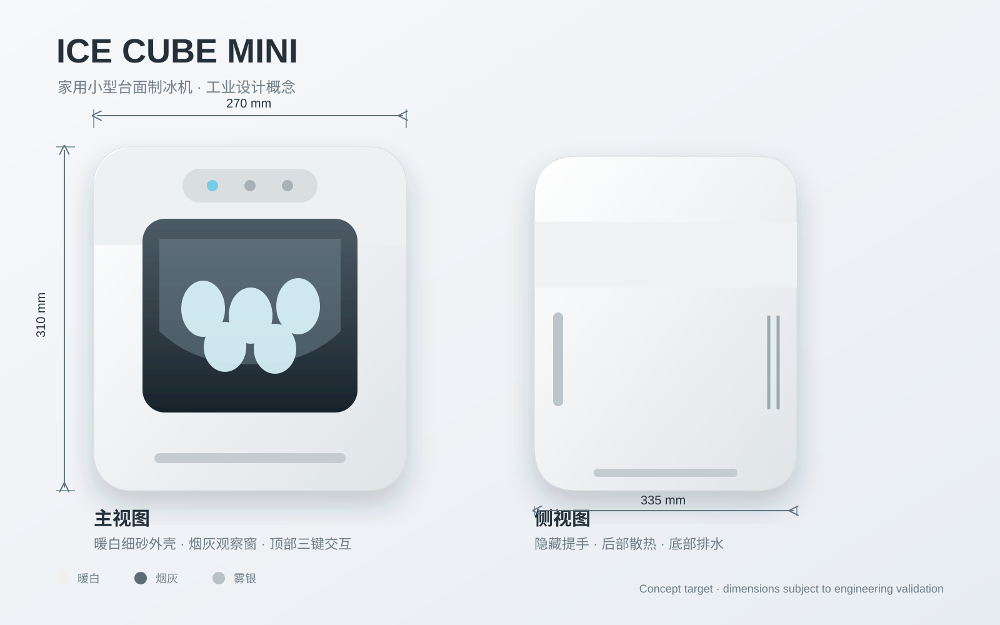

# 家用小型台面制冰机｜工业设计方案

> 项目代号：ICE CUBE MINI  
> 产品定位：面向 1–4 人家庭、租住公寓与小型茶水区的紧凑型台面制冰机。  
> 当前阶段：ID 概念方案；尺寸与性能均为设计目标值，进入结构与制冷验证后冻结。

## 1. 核心设计概念

**“一块安静的冰”**：用纯净、克制的几何体融入厨房与客厅环境。机身采用圆角方体，前部以半透明深灰观察窗形成视觉核心；顶部隐藏操作区，减少家电感和视觉噪声。

- 小巧：占地约一张 A4 纸，适合厨房台面。
- 好用：加水、取冰、排水均在正面或顶部完成。
- 易洁：可拆冰篮、圆角水槽、自清洁程序、食品接触件易拆洗。
- 安静：压缩机悬置、风道隔振、夜间低噪模式。
- 家居化：暖白/雾银为主，避免商用设备的笨重感。

## 2. 建议外形与布局

| 项目 | 设计目标 |
|---|---:|
| 整机尺寸 | 270 W × 335 D × 310 H mm |
| 台面占地 | 0.090 m² |
| 整机净重 | ≤ 7.5 kg |
| 水箱容量 | 1.6 L |
| 储冰量 | 0.6 kg |
| 日制冰量 | 10–12 kg/24h |
| 单次制冰 | 8 颗子弹冰 |
| 首轮出冰 | 约 7–9 分钟 |
| 目标噪声 | 标准 ≤ 45 dB(A)，夜间 ≤ 40 dB(A) |
| 额定功率 | 120–150 W |
| 使用人数 | 1–4 人 |

## 3. 使用流程

1. 打开顶部补水盖，加入饮用水至 MAX 线。
2. 轻触顶部“制冰”键；白色环形灯缓慢呼吸。
3. 选择小冰/大冰，机器自动循环制冰。
4. 前窗查看冰量；冰满或缺水时灯环以图标和颜色提示。
5. 掀开前上盖取出冰篮。
6. 长按“清洁”键 3 秒启动自清洁；底部软塞排出废水。

## 4. 差异化亮点

- **前窗冰量视线**：观察窗倾角让站立视角可直接看到冰篮。
- **三键盲操作**：制冰、冰型、清洁，常用动作无需菜单。
- **隐藏式提手**：机身两侧下缘内凹，搬动时不破坏整体外观。
- **独立排水导槽**：底部排水口配短导流嘴，减少台面积水。
- **夜间模式**：降低风扇转速和提示灯亮度。
- **可拆清洁路径**：冰篮、冰铲、上盖内衬可直接取下清洗。

## 5. 文件说明

- [product-spec.md](./product-spec.md)：尺寸、人机、结构与性能目标
- [cmf.md](./cmf.md)：颜色、材料、表面处理与灯光规范
- [concept-board.svg](./concept-board.svg)：正视/侧视概念与尺寸示意

## 6. 后续开发建议

1. 完成压缩机、冷凝器、水泵、蒸发柱的堆叠校核。
2. 进行散热 CFD 与噪声样机测试，验证侧后方进出风间距。
3. 对水路零件进行食品接触法规与耐温验证。
4. 制作 1:1 外观模型验证补水、取冰、清洁和搬运手感。
5. 冻结结构后输出 A/B 面、装配间隙与 DFM 数据。
